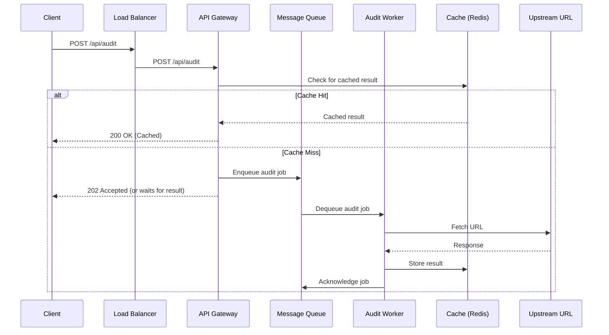

# Architecture Document: Page Pulse at Scale

This document outlines the architecture for scaling the Page Pulse service to handle 10,000 audits per day with bursts of 500 concurrent requests.

## 1. Architecture and Data Flow

### 1.1 Components

The system is composed of the following components:

- **Load Balancer:** Distributes incoming traffic across multiple instances of the API Gateway.
- **API Gateway:** The public-facing entry point of the service. It handles request validation, authentication, and rate limiting.
- **Audit Workers:** A pool of stateless workers responsible for performing the actual URL audits. They are horizontally scalable.
- **Message Queue:** Decouples the API Gateway from the Audit Workers. It smooths out bursts of requests and ensures that audits are not lost if workers are unavailable.
- **Cache:** A distributed cache (e.g., Redis) to store recent audit results for fast retrieval.
- **Database:** A persistent database for storing historical audit data, user information, and other application state. (Optional, depending on long-term data retention requirements).
- **Logging & Monitoring System:** Aggregates logs and metrics from all components for observability.

### 1.2 Data Flow Diagram (Mermaid)

### 1.3 Queueing Strategy

A message queue is critical for handling the required scale and concurrency.

- **Strategy:** We will use a durable message queue. When the API Gateway receives an audit request, it will publish a job to the queue and can immediately return a `202 Accepted` response to the client with a job ID. The client can then poll a separate endpoint to get the result. Alternatively, for a simpler client experience, the gateway can hold the connection open until the result is available, but this is less resilient.
- **Why:** This architecture decouples the synchronous request/response cycle from the longer-running audit process. It allows the system to absorb large bursts of requests without failing, and ensures that audits are processed reliably, even if workers are slow or temporarily unavailable.

### 1.4 State

- **In-Memory:** The `express` application itself is mostly stateless.
- **Cache:** The primary cache for audit results is a distributed Redis cache. This provides a fast, shared cache for all API Gateway and Worker instances.
- **Message Queue:** The queue (e.g., RabbitMQ, SQS) holds the state of pending audit jobs.
- **Persistent Storage:** If long-term storage and analysis of audits are required, a database like PostgreSQL would be used to store historical data. For this design, we will assume it's not a primary requirement for the real-time audit flow.

## 2. Technology Choices

| Component | Technology | Justification | Rejected Alternative | Reason for Rejection |
| :--- | :--- | :--- | :--- | :--- |
| Runtime | **Node.js** | Excellent for I/O-bound operations like making HTTP requests. The large ecosystem and existing codebase make it a natural choice. | Go | While Go has superior performance for CPU-bound tasks, the I/O-bound nature of this service fits Node.js's async model perfectly. The learning curve and smaller ecosystem for our specific needs make it less attractive. |
| Cache | **Redis** | In-memory data store, extremely fast for read/write operations. Provides data structures like Hashes that are perfect for caching. It's distributed, which is essential for a multi-instance deployment. | In-memory Map | Not shared between multiple instances of the application. Not a viable solution for a scaled, stateless application. |
| Message Queue | **RabbitMQ** | A mature, feature-rich message broker that supports multiple protocols. It provides durability, delivery acknowledgements, and is well-suited for the task queue pattern. | Kafka | Kafka is a distributed streaming platform, more suited for high-throughput event streaming and log aggregation. It's more complex to set up and manage than RabbitMQ for this specific use case. |
| Logging | **Pino** | High-performance structured logging library for Node.js. Its low overhead is crucial for a high-throughput service. | Winston | While popular, Winston is known to have higher overhead than Pino. For a service at this scale, performance is a key consideration. |

## 3. Failure Modes and Mitigations

| Failure Mode | Description | Mitigation Strategy |
| :--- | :--- | :--- |
| **1. Upstream Service Unresponsive** | A target URL is very slow, hangs, or is down. This can cause audit workers to become blocked, consuming resources and preventing other audits from being processed. | **1. Aggressive Timeouts:** Implement short, configurable timeouts on all outbound `fetch` requests.   **2. Circuit Breaker:** Use a library like `opossum` to implement a circuit breaker pattern. If a particular host fails repeatedly, the circuit breaker will "open" and fail-fast for a period, preventing workers from wasting time on a known-bad target. |
| **2. Cache/Database Outage** | The Redis cache or persistent database becomes unavailable. This would cause a severe performance degradation (for cache) or data loss (for database). | **1. Redundancy and Failover:** Deploy Redis and any database in a high-availability configuration (e.g., Redis Sentinel, or using a managed service like AWS ElastiCache).   **2. Graceful Degradation:** The application should be able to operate without the cache, albeit with lower performance. It should log the error and continue to function by fetching directly from the source. |
| **3. Sudden Spike in Requests** | A legitimate or malicious traffic spike overwhelms the API Gateway or the audit workers. | **1. Multi-layered Rate Limiting:** Apply rate limiting at the load balancer/API gateway level (per IP) and potentially at the application level (per API key if we have users).   **2. Auto-scaling:** Configure auto-scaling for the audit workers based on queue length. If the number of jobs in the queue exceeds a threshold, more workers are automatically provisioned.   **3. Queue as a Buffer:** The message queue naturally acts as a buffer, absorbing the spike and allowing workers to process the jobs at a sustainable pace. |

## 4. Observability and Rollback

### 4.1 Monitoring and Alerting

We would monitor the following key metrics:

- **API Gateway:**
  - **Request Rate:** Requests per second.
  - **Error Rate:** 4xx and 5xx error rates (%). Alert if 5xx rate > 1%.
  - **Latency:** 95th and 99th percentile response times. Alert if p99 > 500ms.
- **Message Queue:**
  - **Queue Length:** Number of messages in the queue. Alert if length > 1000 for 5 minutes.
  - **Consumer Lag:** Time between a message being enqueued and dequeued.
- **Audit Workers:**
  - **Worker Utilization:** CPU and Memory usage.
  - **Job Throughput:** Jobs processed per minute.
  - **Upstream Error Rate:** Rate of failed audits due to upstream errors.
- **Cache:**
  - **Hit/Miss Ratio:** % of requests served from cache. Alert if ratio drops below 80%.
  - **Latency:** Cache read/write times.
  - **Memory Usage:** Total memory used by the cache.

### 4.2 Rollback Strategy

A **blue-green deployment** strategy would be used for rollbacks.

1.  **Staging/Green Environment:** A new version of the application is deployed to a separate, identical "green" environment.
2.  **Testing:** Automated tests and health checks are run against the green environment.
3.  **Traffic Shift:** The load balancer is configured to route a small percentage of traffic (e.g., 10%) to the green environment.
4.  **Monitoring:** The green environment is closely monitored for errors and performance degradation.
5.  **Full Rollout / Rollback:**
    - If the green environment is healthy, traffic is gradually shifted until 100% of traffic is on the new version. The old "blue" environment is kept on standby.
    - If issues are detected, the load balancer is immediately switched back to the blue environment, effectively rolling back the deployment with minimal user impact.
